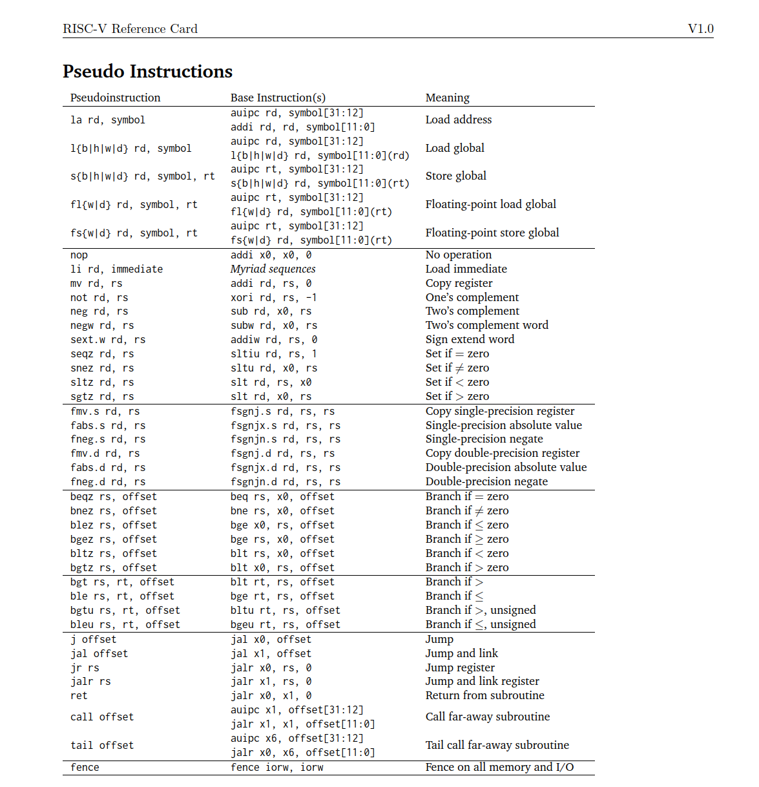
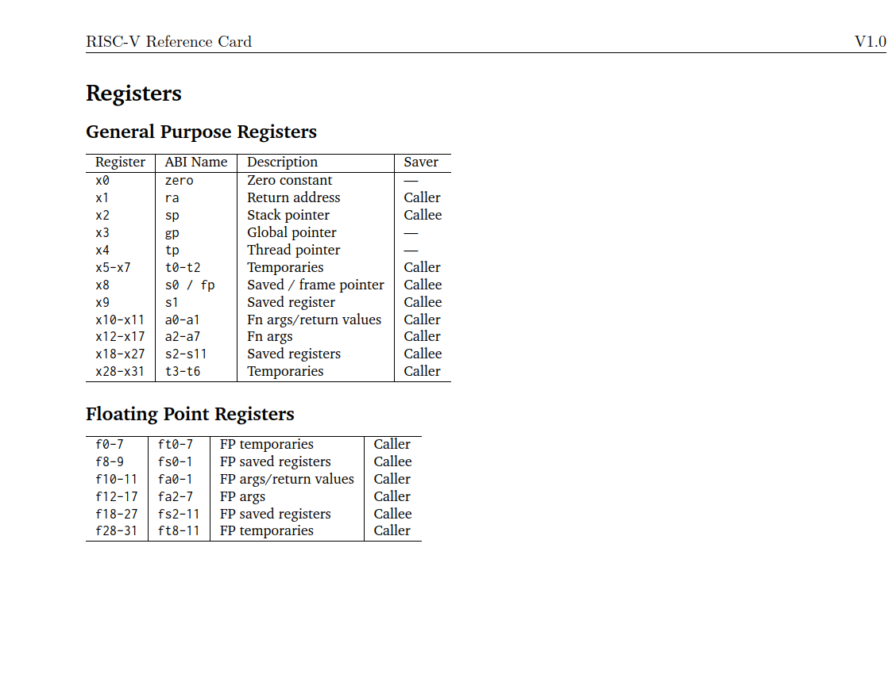
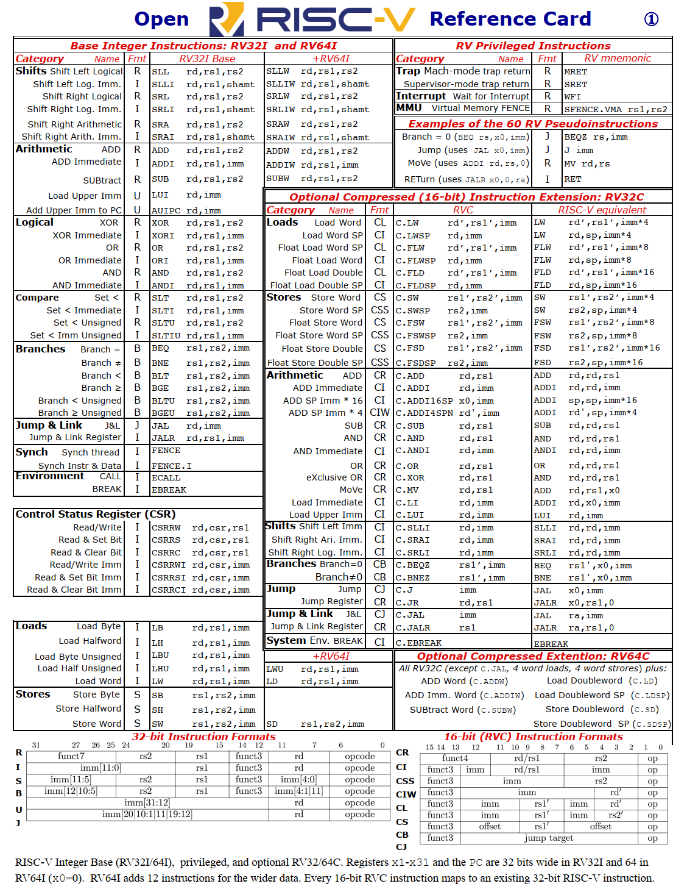

# RISC-V 指令集格式

!!! tips "食用指南"
    点击图片以放大，拖拽图片以在新标签页打开，使用 ++ctrl++ +滚轮 以缩放。

## 指令集格式

来自 jameslzhu 的 [RISC-V Refcard](https://github.com/jameslzhu/riscv-card)，主要包含常见指令及其 opcode，funct 码、其操作逻辑和寄存器命名对应。下图只选了其中关键几页，其余的内容包括 M 乘法扩展、A 原子操作扩展等内容。

## 32位汇编指令格式

汇编指令的书写格式，[University of Cambridge Open RISC-V Refcard](https://www.cl.cam.ac.uk/teaching/1617/ECAD+Arch/files/docs/RISCVGreenCardv8-20151013.pdf)

