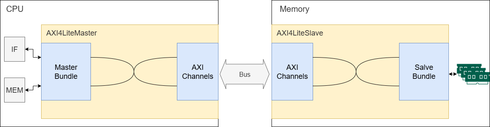

# 实验四 总线

CPU 除了可以通过内存控制器访问内存以外，还可以通过总线协议访问外部设备。使用总线的目的是减少电路布线数量以及电路设计复杂度，避免 CPU 和外部设备之间直接连接。通过统一的总线抽象，CPU 使用总线协议访问外部设备，而不需要知道外部设备的硬件细节，具体的硬件操作则进一步抽象为读写硬件设备上的寄存器。

在本实验中，你将学习到：

- AXI4-Lite 协议
- 使用状态机实现总线协议

在开始实现 AXI4-Lite 总线协议前，请先阅读 [总线](../../theory/bus.md) 以了解 AXI4-Lite 协议的基本知识。

不管使用 IDE 还是执行命令，根目录是 `lab4` 文件夹。

## TODO:

大纲修正为

1. AXI4 接口协议特性、示意图及读写事务
2. 实现选项：使用状态机转换
   1. 给予提示，提供自由实现选项
3. 实现提示：说明时序约束及含义、测试内容、如何查看信号图等
4. 引入总先后流水线控制变化、结构图、MMIO 
5. 提示进行性能对比
6. 实验报告
7. 


## 用状态机实现总线协议

我们本次实验的主要内容就是实现 AXI4-Lite 总线协议里面的主从设备间的读写流程的状态转换。本实验使用 AXI4 通信协议的方法如下图所示，主设备（如CPU）要进行读写时，通过 `AXIMasterBundle` 发起读写，接口 `AXI4LiteMaster` 知悉后通过 AXI4 协议在总线上发起读写事务。从设备的接口 `AXI4LiteSlave` 被动地接受事务，并将读写请求转达给从设备（如内存、计时器等）。事务通信过程中，`AXI4LiteMaster` 和 `AXI4LiteSlave` 使用某种机制来记录读写请求并完成 AXI4 协议规定的通信操作。





为简单起见，我们使用状态机来实现 AXI4 接口，即 `AXI4LiteMaster` 和 `AXI4LiteSlave` 用状态机实现，在握手完成时进行状态转换，以此逐个完成事务。我们给出一个可参考的状态机，如下图，左图是主设备总线接口的状态机，右图是从设备总线接口的状态机：


###  进行一次读操作

通过上面的资料学习，相信你已经对总线有一个大概的了解，现在我们整理一下 CPU 通过总线取指令的过程。以下给出 `MasterBundle` 的定义，它是 CPU 操纵总线接口进行通信的接口，以及上述状态机实现的 6 个状态：

```scala
object AXI4LiteStates extends ChiselEnum {
  val Idle, ReadAddr, ReadData, WriteAddr, WriteData, WriteResp = Value
}
class AXI4LiteMasterBundle(addrWidth: Int, dataWidth: Int) extends Bundle {
  val read = Input(Bool())          // request a read transaction
  val write = Input(Bool())         // request a write transaction
  val read_data = Output(UInt(dataWidth.W))
  val write_data = Input(UInt(dataWidth.W))
  val write_strobe = Input(Vec(Parameters.WordSize, Bool()))
  val address = Input(UInt(addrWidth.W))
  val busy = Output(Bool())         // if busy, master is not ready to accept new transactions
  val read_valid = Output(Bool())   // indicates read transaction done successfully and asserts for ONLY 1 cycle.
  val write_valid = Output(Bool())  // indicates write transaction done successfully and asserts for ONLY 1 cycle.
}
```

首先，我们的取指级（IF）应该发出取指信号，包括将 `AXI4LiteMasterBundle` 的 `read` 置 1，并将 PC 送至 `address`，
这时 CPU 的 AXI 主机（AXI Master） 接口收到 IF 的信号，如果该主机处于空闲状态 (Idle) 则对本次读请求做出响应，主机内部状态由空闲跳转到 读地址状态 (ReadAddr)，产生并发送读请求 (`ARVALID`)、读地址 (`ARADDR`)。

当内存模块的从机（AXI Slave） 接收到 `ARVALID` 且空闲时，其内部状态跳转至 读地址状态 (ReadAddr)，保存 `ARADDR` ，并将 读地址准备(`ARREADY`) 信号置 1 表明读地址已收取，这时就完成了一次读地址的握手。获取读取地址后，从机通过 `AXI4LiteSlaveBundle` 告知内存芯片读取指定位置的数据。

当内存芯片返回读出数据时，传回给从机。从机 跳转至 读数据状态 (ReadData) ，将读出数据传入 读数据 (`RDATA`)、读返回请求 (`RVALID`)；主机此时也跳变到 读数据状态 (ReadData)，并将 `RREADY` 置 1，表明准备好接受读出的数据。

当主机发现 `RVALID` 和 `RREADY` 均为 1 时完成握手，其将读出数据 `RDATA` 通过 `AXI4LiteMasterBundle` 的 `read_data` 传回至取值级，同时将 `read_valid` 置 1 持续 1个时钟，表明这次读取操作成功，随后主机跳转回空闲状态。

另一边，当从机发现 `RVALID` 和 `RREADY`完成握手时，其也重返空闲状态。


###  如何进行写操作

相比于读操作，写操作的流程多一个写反馈的握手，如果你理解了读操作是如何握手的，那么写操作的流程应该不成问题。

!!!tips "状态机的具体实现"
    我们提供了灵活的测试方法，主从机的状态转换可以不必按照上面所说的一字不差，只需要能达到测试中要求的读写正确、功能正常即可。你可以观察测试产生的波形图，从而优化实现以减少读写操作的周期数，甚至跳过某些上述的主从机状态。


## 有了总线之后的 MMIO

CPU 发出访存地址，我们需要通过一个模块来根据这个地址的范围来确定让哪个从机来和主机握手，它的设计思路和没有总线的情况下是一样的，都是通过地址的特定部分译码出控制信号，然后选通对应设备。

就是识别CPU发给总线模块的地址，然后通过复用器选择对应的外设即可，不要求实现，代码位于 `src/main/scala/bus/BusSwitch.scala`。


## 把总线加到你的流水线上

从预备知识里面我们知道了需要有总线仲裁这个模块，来协调总线主机响应来自 CPU 哪个阶段的读写请求信号。

目前我们的流水线上，无论是三级还是五级，都只存在取指单元和访存单元之间的冲突。这显然也是一种结构冲突（Structural Hazard）。所以可以用 Lab 3 实验中解决冲突的思路，通过阻塞流水线来保证指令流的执行，即如果访存阶段没有占用总线，IF 单元才能够取指。


## 更多关于总线的知识

实际上把总线加到我们原来的 CPU 上后，会发现 IPC 大幅下降，变得很慢。

主要原因是总线握手花费了大量的时间。而 AXI4-Lite 协议又是 AXI4 协议的简化版本。为了实现上的简单，所以没有实现突发传输（burst）的功能，所以每次最多读写一个数据总线宽度的数据，即每次都需要重新进行各个读写通道的握手，导致效率很低。

解决的一个办法就是加缓存。根据局部性原理，我们可以为取值单元与内存之间加上指令 Cache（I-cache），为访存单元与内存间加上数据 Cache（D-cache），这样就可以加速数据的存取。

而这样的实现方案里面 D-cache 和 I-cache 同样是需要通过总线访问内存的。但是由于 Cache 是以 Cache Line 为单位存取的。假设一个 Cache Line 为 128 字节，当我们的总线数据位宽为 4 字节的时候，填充缓存行需要从内存读 128 / 4 = 32 次，
并且这每一次需要重新进行读地址握手、读数据握手。而 AXI4 协议就是在AXI4-Lite的基础上加上了 Burst 的功能，即在读写请求中可以指定传送数据的个数，从指定地址传连续的多个数据给从机，
而读数据握手时，就可以连续获取相应的那么多个数据。这样的协议就是突发传输（burst），为了实现这个协议，主从设备为了握手通信，需要设置更多的寄存器（指定读取数据个数的 RLEN，指示是否为最后一个数据的 RLAST 等），状态机转换也需要更为复杂。

这样一来我们从两个方面来加速我们的 CPU，一是 Cache，我们不需要通过总线来获取数据；二是实现完整的 AXI4 协议。而从理论上来说，如果实现了 Cache 而没有实现 AXI4 的 burst 机制，加速效果也不会很明显。所以可以先实现 Cache 然后实现 burst 来体会一下。


---

## 实验任务


主从设备的状态机切换图在预备知识里面给出了，不需要自己去总结，实现所需的寄存器和模块输入输出接口已经给出，你只需要实现状态切换以及相应的握手信号。

<!-- !!! warning "注意实现细节"
    - 请严格按照给定的状态转移图来实现状态机，因为我们的测试模块的测试代码就是根据这个图来设计的，所以快一个周期，慢一个周期完成握手都可能通不过测试。
    - Lab 4 提供的框架代码和之前的有点差别，但是内容就是流水线+中断+总线。可以先熟悉一下代码（不熟悉代码也没关系，这和实现总线模块状态切换没很大关系） -->

!!! note "实验任务：实现 AXI4-Lite 协议主从机" 
    主从设备的代码位于 `src/main/scala/bus/AXI4Lite.scala`，请在标有 `//lab4 (BUS)` 的注释处，实现AXI4Lite主从机的内部逻辑，并：

    - 通过 `src\test\scala\riscv` 下的 `BusTest.scala`，和三级、五级流水线下的 `CPUTest.scala` 中的测试
    - 查看 `BusTest` 中 `FunctionalTest` 输出的读写事务消耗了多少个周期
    - 查看 `CPUTest` 中 `Fibonacci` 和 `Quicksort` 输出的消耗时钟周期

!!! tips "如何检测自己实现的 AXI4-Lite 主从机正确性"
    上一版的测试代码要求严格按照给定状态机实现，这一版提供了允许自由实现 AXI4-Lite 协议的测试，并加入测量读写事务耗时的功能。
    
    如果你发现代码无法通过测试，可以查看 `BusTest.scala` 中 `FunctionalTest` 产生的波形图，并查看相应通道的信号，来了解自己实现能否完成最基本的读和写操作。该方法也可以帮助你改进实现，减少读写操作的周期数。


## 实验报告

1. 简述您的 AXI4-Lite 主从机实现逻辑。如果有，描述您通过什么方法改进了实现及性能提升。
2. 简要概括`BusTest`中测试的原理，以及测试用例的执行结果。
3. 【可选】参考[硬件调试](../../practice/hardware-debug.md)一节的内容，用硬件波形的方法捕获程序运行结果。分析 Vivado 是否能正确识别并组合 AXI4 总线协议的传输信号以及过程。
4. 在完成实验的过程中，遇到的关于实验指导不明确或者其他问题，或者改进的建议。 


## What's next? 

同学们在完成了本实验后，就应该具备根据状态转移图来实现状态机的能力了。如果有兴趣的话，可以尝试一下实现简单的 Cache，然后再实现 burst。包括后面希望实现 MMU，最简单的实现也可以用状态机来实现。所以，你可以放开手脚在 YatCPU 的基础上探索了（当然你也可以自己从头实现）。

实现好总线模块的逻辑后，你可以尝试给 Lab 3 的基础上或者是给 Lab 2 的 CPU 接上总线（现有的 YatCPU 的五阶段流水线+总线代码里面的一些逻辑问题在 Lab 3 实验代码中修复了，但是还没有合并到主仓库，Lab 4 用的还是主仓库现有的代码）

此外同学们也可以思考如何做CPU设计架构的优化，比如现在的 CPU 只有 ID 和 MemoryAccess 阶段对总线有需求，所以总线仲裁比较简单（集成在 `CPU.scala` 里了）。但是如果后面再加上 MMU，那么 CPU 的总线主机模块应该由哪个模块使用，这部分逻辑就会变得更复杂点，而这部分逻辑其实是可以单独拿出来实现的。

