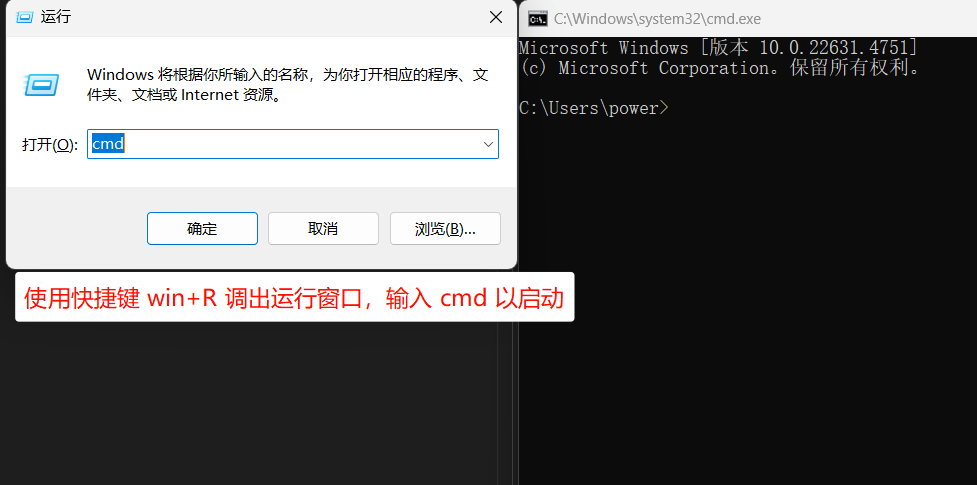
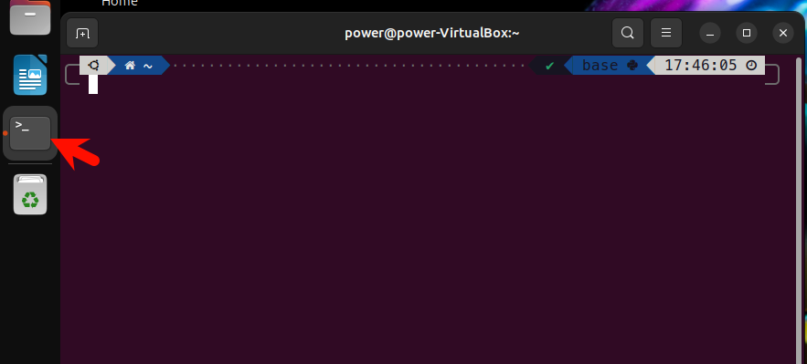
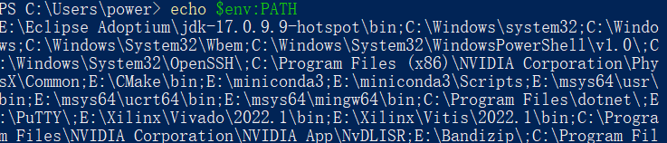
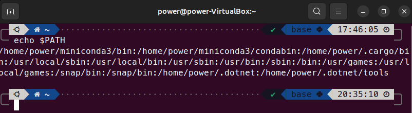
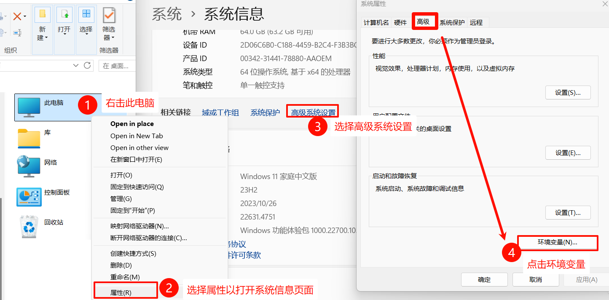
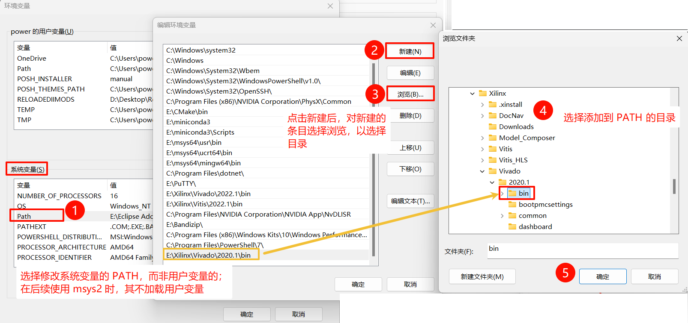

# 环境变量、Shell 与 常用指令

Writen By: [PurplePower](https://github.com/PurplePower)

本节将介绍使用计算机的基本技巧：了解并设置环境变量及常用的指令。这些是计算机学科实践的必要技能，也在后面实验中频繁用到。


## 环境变量

环境变量（Environment Variables）是一系列用户定义的变量，可以影响进程的运行。环境变量就如同 C++ 中声明一个变量，它可以被操作系统和各种程序读取和修改，以帮助程序顺利执行。

环境变量的概念在 Windows 和 Linux 上都存在，但它们的语法和使用略有区别，我们通过一些实际操作来认识他们。

首先我们来打开一个终端窗口（Terminal）：

???+ abstract "实践：打开一个终端窗口"

    === "Windows CMD"
        {width=70%}

        如图，使用 Win+R 快捷键调出运行窗口，输入 cmd 即可打开命令行窗口。
    === "Windows Powershell"
        {width=80%}

        如图，使用 Win+R 快捷键调出运行窗口，输入 powershell 即可打开命令行窗口。您也可以使用其他终端软件，如 Windows Terminal等。
    === "Linux"
        {align=left, width=70%}
        
        如图，如果您使用带 GUI 界面的 Linux，如 Ubuntu，则可以在桌面栏点击 Terminal 图标以打开一个可以输入文字的终端窗口。

下一步我们将使用 `echo` 指令，一条在上述三种 shell 中都可使用的打印指令，我们直接看在不同 shell 下打印的指令，及得到的结果：

???+ abstract "实践：打印 PATH 环境变量"

    === "Windows CMD"
        ```bat
        echo %PATH%
        ```

        

    === "Windows Powershell"
        ```powershell
        echo $env:PATH
        ```

        

    === "Linux"
        ```bash
        echo $PATH
        ```

        

可以看到，在这几种 shell 中，如何指代环境变量的方法各有不同：Windows 上的 `cmd` 使用百分号来包裹环境变量名 `%<name>%`，`powershell` 则使用 `$env:<name>`，而 Linux 上的 `bash` 则使用 `$<name>`。另外，Windows 和 Linux 的环境变量中多个值的分隔符也不同，Windows 使用分号 `;`，因为引号会作为盘符后的分隔符而存在于路径中，Linux 则使用引号 `:`。此外还有一个需要注意的点是，Windows上的环境变量名不区分大小写，而 Linux 上则是大小写敏感的。

---

## PATH 环境变量及其修改

您已经学会使用 echo 指令查看环境变量名了，那么这些环境变量具体有何用途呢？下面将介绍 PATH 环境变量，该变量在系统运行中起着至关重要的作用，包括后面您安装软件后如何在终端直接调用该软件。

PATH 环境变量是系统保留的环境变量名，它包含了一系列目录路径，当您在输入一个不是完整绝对路径的指令时，系统将会在 PATH 包含的目录下寻找该指令对应的程序。
例如在 Windows 中输入 `notepad` 指令时，系统会在 PATH 包含的目录中寻找名为 `notepad` 的可执行程序，并最终在 `C:\Windows\system32\` 目录下找到 `notepad.exe` 的记事本程序，并最终启动。如果未找到，则系统会提示输入的内容无法被识别为指令，此时您需要在 PATH 中添加对应的路径，或者使用完整的路径名以执行该程序： `C:\Windows\system32\notepad.exe` 。


为了能正确运行某些程序，必须对 PATH 系统变量进行修改。一般只在 Windows 上需要，Linux 在安装大多数软件时已经由系统的软件管理器完成修改。下面介绍永久修改系统变量的方法，使该修改在关闭终端或重启后仍然生效。


???+ abstract "实践：永久修改系统变量"

    === "Windows"

        您可按下图步骤打开系统变量编辑窗口：

        

        随后，您可以修改系统变量 PATH。例如，当您希望能直接在命令行键入 `vivado` 以正确调用 `E:\Xilinx\Vivado\2020.1\bin\vivado.bat` 时，您应添加该文件所在路径 `E:\Xilinx\Vivado\2020.1\bin`，而非包含文件名的路径。

        

        随后，您需要逐步点击“确定”以保存修改。系统变量修改后，您需要重新打开命令行或 powershell 以使其生效。您可以重新打印 PATH 变量以检查是否正确设置。

    === "Linux"

        !!! warning 

            本课程中，若您使用 Linux 环境，您***无需***修改 PATH 变量。
            Linux 软件安装可以通过软件管理器，如 Ubuntu 的 apt、CentOS 的 yum 等，或从源文件安装（install from source）。前者会自动管理相应的 PATH 变量，后者大多使用 make 构建系统中会包含自动设置的内容。

            除非您清楚您确需修改 PATH 变量，否则您不应修改以免导致意外的故障。您可以 Google 搜索 How to permanently set $PATH on Linux ，或询问大语言模型（注意辨别其回复的正确性）以操作。


但有时我们只希望对某些系统变量的修改是暂时的，比如在进行环境配置的调试时，此时可以在 shell 中直接修改系统变量的值，该修改在只会在这个终端窗口的 shell 中生效，且关闭后就失效。

???+ abstract "实践：暂时修改系统变量"

    === "Windows CMD"
        ```bat 
        set PATH=%PATH%;D:\new\added\path
        ```
    === "Windows Powershell"
        ```powershell
        $env:PATH+=";D:new\added\path"
        ```
    === "Linux"
        ```bash
        export PATH=$PATH:/home/new/added/path
        ```


---

## 常用指令

接下来您将了解常见的指令。

在您学习这门课前，您可能极少使用纯文本的 shell 界面进行操作，而是使用 GUI （Graphical User Interface）通过鼠标直观地操作。两种方式各有其优劣，但作为计算机专业的学生，在 shell 中使用各种指令进行操作是不可或缺的技能，熟练后这将比使用 GUI 更高效。

以下常见功能在不同系统上的指令如下表所示，您可以在终端中尝试输入并查看结果。


| 功能  |  Windows cmd  |  Powershell  |  Linux  |
| :---  | -----------  |  ---------  |  ---------- |
| 列出目录下内容    | `dir`    | `ls`      | `ls`    |  
| 打印变量或字符串  |  `echo <things to echo>`  {colspan=3, align=center} |
| 修改当前目录（change directory）| `cd <directory>`，可用 `cd ..` 快速返回上一级目录 {colspan=3, align=center} |
| 设置变量          | `set MYVAR="VALUE"` | `$MYVAR="Value"` | `export MYVAR=Value` | 
| 清空当前显示内容   | `cls` | `cls` | `clear` |
| 查询文件路径      | `where gcc` | `Get-Command gcc` | `which -a gcc` 或 `whereis gcc` |

当然，还有许多指令选项及搭配组合未列出。若您想要实现某些功能，但不知道要使用哪些指令，则您可以向 Google 或大语言模型提问： how to ... in linux bash / cmd 。若您已经知道使用何种指令，但需要调整指令的选项，例如上方 linux 里 `which` 的 `-a` 选项是显示所有结果，则您可以查询该指令的 manual ，一些网页记录了这些内容，如 [Man7 linux manual](https://man7.org/linux/man-pages/index.html) 。
