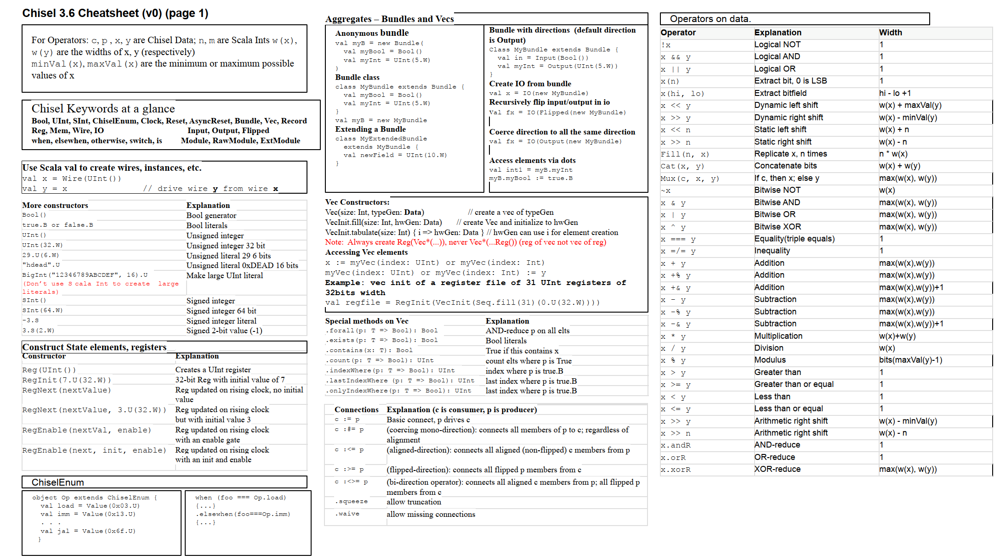
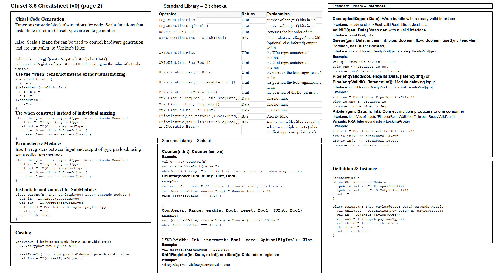

# Scala 和 Chisel 编程语言

Writen By: [Howard Lau], [Tiger9Tu], [PurplePower](https://github.com/PurplePower)

> 工欲善其事，必先利其器。


## Chisel 3 的基本语法和功能

Chisel 3 是使用 Scala 语言的**宏**特性实现的一门领域特定语言（Domain Specific Language）。所以，所有涉及到电路逻辑的编程，都需要使用 Chisel 3 包中提供的宏定义实现，而不能直接使用 Scala 语言的关键词。具体而言，如果想要在电路中使用一个常量，例如 `12`，并将其与电路 `value` 比较，我们不可以写 `if (value == 12)`，而是要写 `when(value === 12.U)`。熟记这一最基本的概念，才能正确编写出合法的 Chisel 3 代码。

### 基本类型

和其他编程语言类似，Chisel 3 也支持一些基本类型，包括整数、布尔值等。

### 无符号整数与有符号整数

Chisel 3 中无符号整数类型为 `UInt`，有符号整数类型为 `SInt`。在声明整数的时候，可以通过 `.W` 来指定整数的位宽，例如 `UInt(8.W)`。如果想将一个 Scala 中的整数转换为 Chisel 3 的硬件整数，可以使用 `.U` 操作符，例如，`12.U`。`.U` 操作符同样支持通过 `.W` 指定位宽，例如 `12.U(8.W)`。

### 布尔值

Chisel 3 中布尔值类型为 `Bool`，可以通过 `.B` 来将 Scala 布尔值转换为硬件布尔值，例如 `true.B`。

### 模块

在 Chisel 3 中，声明一个模块需要继承 `Module` 类，并通过 `io` 成员声明模块的输入输出端口。

```scala
import chisel3._

class MyModule extends Module {
    val io = IO(new Bundle {
        val in = Input(UInt(8.W))
        val out = Output(UInt(8.W))
    })
}
```

在 Chisel 3 中，每个模块除了声明的 IO 端口，还隐含了时钟信号 `clock` 和复位信号 `reset`。

### 组合逻辑

```scala
val wire = Wire(UInt(8.W))
val wireinit = WireInit(0.U(8.W))
```

### 时序电路

### 寄存器

```scala
val reg = Reg(UInt(8.W))
val reginit = RegInit(0.U(8.W))
```

Chisel 3 中的寄存器默认也带有 `clock` 和 `reset` 信号，所有对于寄存器的写入操作都将在时钟的上升沿生效，并在复位信号为 `true` 时复位为初始值（如果指定了的话）。

### Chisel 3 与 Verilog 的关系

Chisel 3 严格意义上并不是 Verilog 的等价替代，而是一个生成器语言。使用 Chisel 3 编写的硬件电路，需要编译成 Verilog 文件，然后再通过 EDA 软件综合实现出真正的电路。而且，为了通用性，一些 Verilog 中的特性，如负边缘触发、多时钟仿真等在 Chisel 3 中并不支持，或支持程度有限。


## Chisel 3 项目结构

同学们在进行本次实验的过程中无需了解整个项目的所有文件，只需要专注于 `src/main/scala` 下的 `.scala` 代码文件即可。不过为了避免困惑，还是在此为大家介绍一下本项目的结构。
```
- labx
    - coremark              # CPU 性能测试
    - csrc                  # 存放汇编语言和 C 语言源代码
    - project               # sbt 的插件以及配置文件
    - src 
        - main
            - scala         # Chisel 3 源代码 <--
        - resources         # 资源文件
        - test
            - scala         # Chisel 3 测试代码 
    - target                # sbt 生成的文件
    - test_run_dir          # 运行测试时生成的文件
    - verilog               # Verilog 代码
    - vivado                # tcl 脚本以及约束文件（用于自动化烧板）
    - build.sbt             # sbt 配置文件
```

## 练习

!!! abstract "实践：动手练习 Chisel"

    完成 [Chisel 3 在线实验](https://mybinder.org/v2/gh/freechipsproject/chisel-bootcamp/master) 的 `3.6_types` 以及之前的所有练习，这样您将具备基本的硬件设计能力。

## 参考资源和 Cheat Sheet

尽管上网搜索或询问 LLM 可以很快找到需要的 Scala 和 Chisel 语法，但可能更快的方法是查找 Cheat Sheet，里面用简短的数页列出最常用的操作用法。以下是一些 Cheat Sheet，您可以点击下载或上网搜索其他版本：

[free chips project Chisel 3.6.0 Cheat Sheet](https://github.com/freechipsproject/chisel-cheatsheet/releases/download/3.6.0/chisel_cheatsheet.pdf)







若您需要深入了解 Chisel 中的相关内容，您可以查阅 Chisel Book，改书适合新手入门 Chisel 并通过实践逐步深入。
在本课程的学习中，您可以结合前述在线练习，简要地从本书了解 Chisel；或在遇到语法困难时才查询此书。
[Chisel Book（有中文版）](https://www.imm.dtu.dk/~masca/chisel-book.html)


