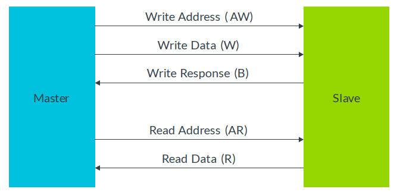
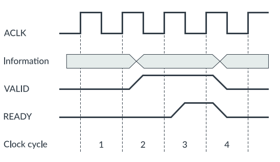
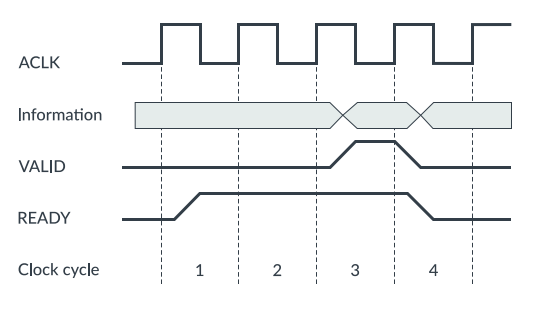
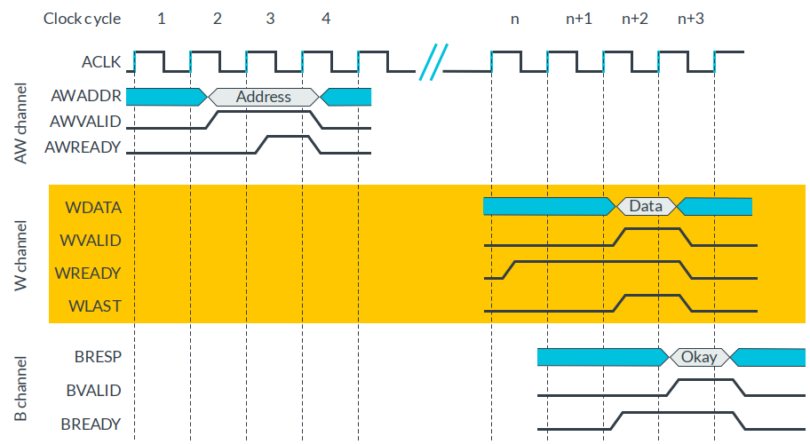
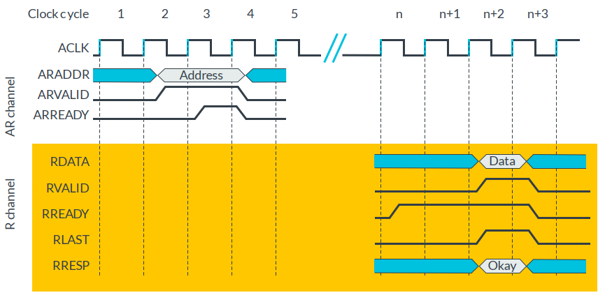

# 总线

By: [:material-github: howardlau1999](https://github.com/howardlau1999)

## 简介

CPU 和其他设备如果想要通信，那么就要和其他设备在物理上连接起来。如果每个设备都像内存一样，需要修改 CPU 的设计和 IO 端口才能连接，那么假如有 m 种 CPU 和 n 种外设，复杂度将成为 O(mn)，不仅每个 CPU 都要适配所有的外设，而且还要把所有的外设都适配到所有 CPU 上，这样的复杂度是不现实的，同时也不灵活。这时，我们就得想到计算机科学的一条“金科玉律”：

> Any problem in computer science can be solved with another level of indirection. [^1]

[^1]: <http://bwlampson.site/Slides/TuringLecture.htm>

既然直接连接起来不现实，那么我们就通过引入一个通用的中间层，让大家都连接到这个中间层，不就把复杂度变为 O(m + n) 了吗？人们觉得这个想法不错，并给这种技术起了一个形象的名字：总线（Bus）。正如它的英文所展示的一样，数据不再是直接在 CPU 和外设间传递，而是先搭上总线这个“公交车”，到达目的地之后再“下车”。

当然，任何的额外的间接层都是有代价的，引入总线有两个问题需要解决：

1. 数据怎么知道它的目的地是哪里？
2. 好几个设备都想同时发送数据，然而总线只允许一个设备发送，要如何仲裁？

而且，作为一层通信协议，各家设备厂商都想设计一套最适合自己设备的协议，于是，总线协议也是百花齐放，有 PCI-e、I2C、USB、AXI 等等……不同总线协议也有不同的使用场景，应当支持哪些协议也是一个需要权衡的问题。

## AXI 总线通信协议

通常而言，总线在传输数据的时候，在保证总线没有被其他设备占用后，发起通信的一方会先发送控制信号，表明接下来传输的数据的设备地址和长度等，目标设备在收到控制信号后，就开始数据的传输过程。

AXI 协议是由 ARM 公司提出的总线通信协议，目前最新版本是 AXI4，并且提供了精简的 AXI4-Lite 协议。AXI 协议的主要特性列举如下：

- 独立的读写通道
- 允许多个活跃的地址，即主设备可以在前一操作未完成时发起新的读写操作。
- 数据和地址传输没有严格限制，写入时既可地址再数据，也可反之。
- 簇发传输（Burst）

本实验所用的总线协议是 AXI4-Lite，并实现一个基础的简单版本，上述的高级特性仅供有兴趣的同学实现。
ARM 提供了 [AXI4 协议的简介](https://developer.arm.com/-/media/Arm%20Developer%20Community/PDF/Learn%20the%20Architecture/102202_0100_01_Introduction_to_AMBA_AXI.pdf?revision=369ad681-f926-47b0-81be-42813d39e132) 可供参考。

AXI4上的读写的流程如下图所示：

左图是主设备发起的读流程，右图是主设备发起的写流程。相比起读流程，写流程多了一个写的回复响应，这是因为从设备内部可能有缓冲区，在数据真正写入完成之前，从设备可以不发送响应信号，从而保证数据的完整性。

AXI4 使用了 5 个 通道以完成上述地址、数据和响应信号传输，如下图所示：

{width=80%}

这些通道中，AW、W 和 B 通道负责写操作，AR 和 R 负责读操作。每个通道都遵循握手协议以完成传输，**握手** 由 `VALID` 和 `READY` 信号完成。 `VALID` 表示通道上的信号有效，例如主设备将 `AWVALID` 置 1 时，说明此时 `AWADDR` 的值是有效的写地址。`READY` 信号表示准备好接受数据了，例如从设备将 `AWREADY` 置 1 时，说明其准备好接受写入地址。

当双方发现 `VALID` 和 `READY` 同时为 1 时，双方握手完成，表明数据成功传达。
下面展示了两个握手的时序样例：

{width=90%}
/// caption
握手示例1：主设备将信息和 `VALID` 置 1 后，从设备置 1 `READY` 完成握手。
///

{width=90%}
/// caption
握手示例2：从设备提前置 1 `READY`，主设备将 `VALID` 置 1 后完成握手。
///

了解了通道的握手机制后，就可以按前述读写流程进行读写操作了。

/// caption
写操作时序图：主设备先在 AW 写地址通道传输写地址，发起一次写操作。W 通道再将写的数据传输至从设备（实际上 AXI4 协议不要求地址和数据的先后关系，W 也可以在 AW 前先传输）。此时从设备得知写操作的信息，写入完成后通过 B 通道回应。
///

/// caption
读操作时序图：主设备在 AR 读地址通道传输读地址，发起一次读操作。从设备随后在 R 通道将读出数据传回。
///

## 总线仲裁

由于总线是多个设备共享的，如果多个设备同时发起通信，那么信号会产生冲突，导致传输过程无法正常进行。为了避免冲突的发生，所有设备在通信之前，都应该检测总线是否占用。

为此，每一个设备则需要增加总线请求线以及总线授权线，连接到总线仲裁器。在设备需要通过总线传输数据前，需要先通过总线请求线请求总线的访问权限。总线仲裁器则通过总线授权线来授予访问权限，从而避免设备之间的冲突。

## 总线交换机

由于总线仲裁的方法可能会导致一些设备长时间的等待，总线也可以使用类似网络交换机的方式连接，不同对的设备之间可以通过交换机同时进行通信。