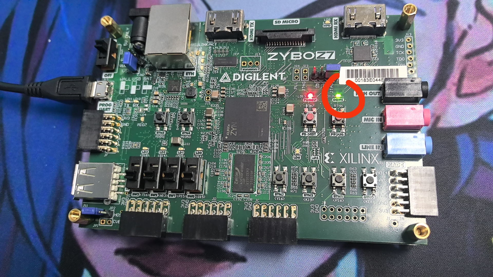

Writen By: [Tokisakix](https://github.com/Tokisakix)

# 如何使用一键烧板脚本

> 此烧板脚本对任意方式配置的开发环境都有效，因为 vivado 的烧板跟开发环境是**相互独立**的，如果你使用 Dev Container 或 WSL 配置环境，你需要回到 Windows 下打开 PowerShell 进行烧板。
> **此部分内容借鉴自 [YatCPU 的烧板验证](https://yatcpu.sysu.tech/getting-started/program-device/)**

原则上你可以在任意一个 lab 文件夹中使用下方的脚本进行烧板，下方的演示路径为 <code>2023-fall-yatcpu-repo/mini-yatcpu/</code>

**生成 Verilog 文件**

下面的教程以 ZYBO-Z710 开发板为例，其他开发板可以根据开发板名称自行替换。

根据开发板型号，在命令行输入对应型号的运行指令，运行相应目录的 Top.scala 文件，生成的结果位于 verilog/开发板名称 目录下的 Top.v，下方是参考的代码：

```
sbt "runMain board.z710.VerilogGenerator"
```

你也可以在配置好环境的 IDEA 中打开 src/main/scala/board/z710/Top.scala，点击 object VerilogGenerator extends App 一行左边的绿色三角形运行即可。

**生成比特流二进制文件**

执行下述指令，可以根据 verilog/z710/Top.v 生成二进制文件 vivado/z710/riscv-z710/riscv-z710.runs/impl_1/Top.bit。

假设你的 Vivado 安装目录是 ~/Xilinx(其他目录自行修改):

```
cd vivado/z710
~/Xilinx/Vivado/2020.1/bin/vivado -mode batch -source ./generate_bitstream.tcl
```

**烧板**

执行下述指令，可以将二进制文件 vivado/z710/riscv-z710/riscv-z710.runs/impl_1/Top.bit 烧录到跟设备连接的开发板上。

假设你的 Vivado 安装目录是 ~/Xilinx(其他目录自行修改):

```
cd vivado/z710
~/Xilinx/Vivado/2020.1/bin/vivado -mode batch -source ./program_device.tcl
```

**如果烧板无误，你会看到黄灯亮起**



后续将上述 program_device.tcl 换成 generate_and_program.tcl 可以将生成比特流和烧板在一个脚本中完成。